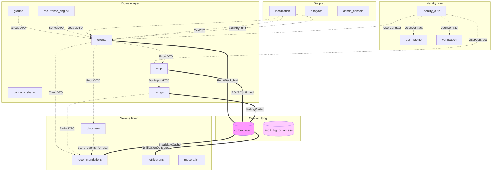
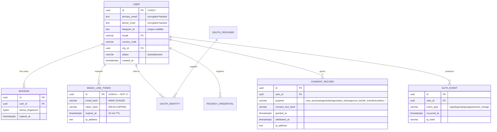
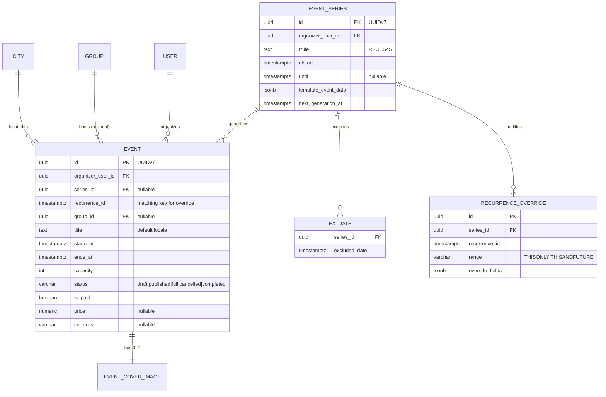
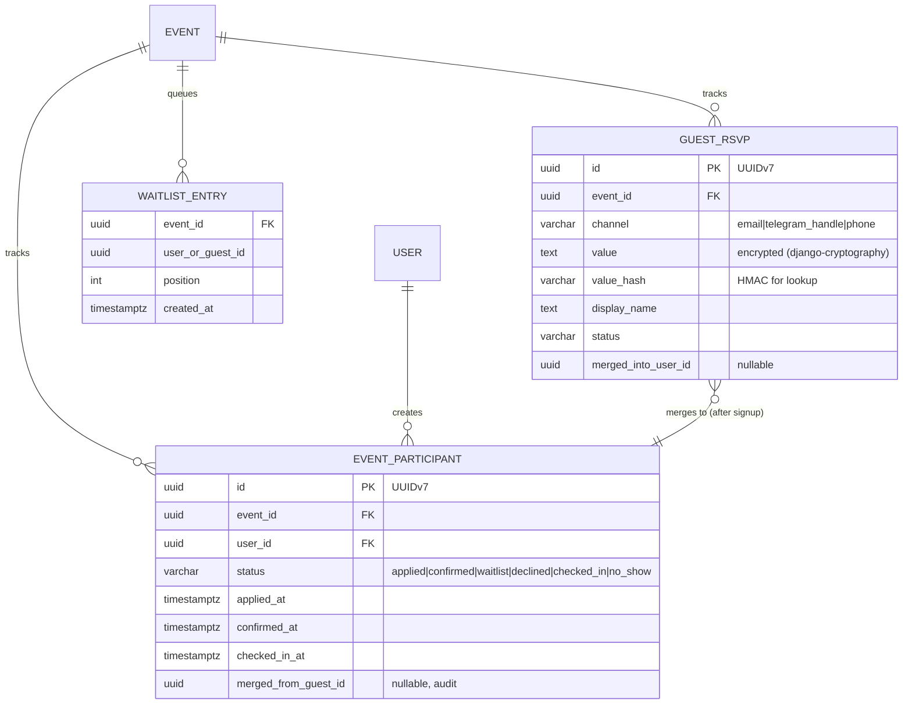
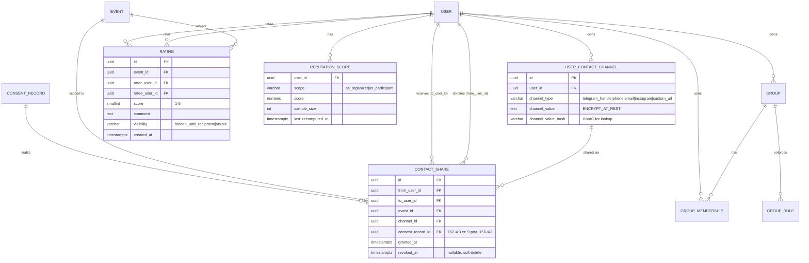
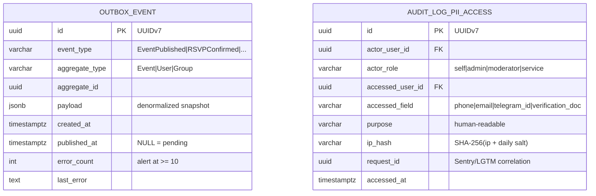
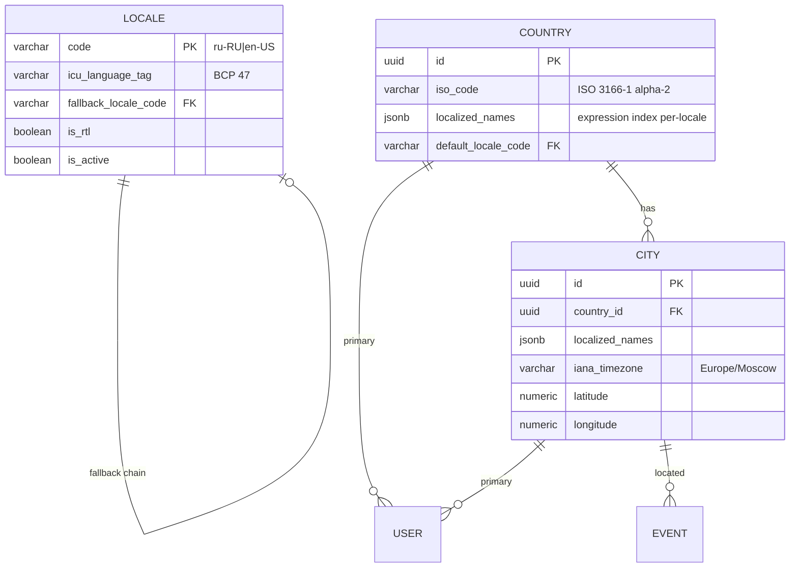

# Act — Entity-Relationship Diagram (ERD)

> Mermaid ERD для 16 bounded contexts. Полный domain-model snapshot для Phase 1 Bootstrap.
> Источники: `docs/ARCHITECTURE.md` § Основные сущности + 6 готовых Level C (identity_auth, events, rsvp, contacts_sharing, recommendations, localization) + Wave 3 (audit_log_pii_access, outbox).
> Дата: 2026-05-27.

## 1. Bounded Context overview (cross-context dependencies)

**Легенда:**
- `-.DTO.->` — synchronous cross-context import через `contracts.py`.
- `==Event==>` — async cross-context через `outbox_event` (ADR-016, никаких Django signals).

## 2. Identity & Auth (Level C готов)

## 3. Events + Recurrence (Level C готов)

## 4. RSVP & Attendance (Level C готов)

## 5. Contacts Sharing + Ratings + Groups

## 6. Cross-cutting infrastructure (Outbox + Audit)

## 7. Localization справочники

## Notes

- **Mermaid rendering**: GitHub README/wiki, VS Code preview, `mermaid-cli` для статической генерации SVG.
- **Cardinality notation**: `||--o{` = 1:N, `||--||` = 1:1, `||--o|` = 1:0..1, `}o--||` = N:1.
- **Type hints**: ORM-mapped types (uuid, varchar, jsonb, timestamptz, inet); фактические Django field types — в `apps/<ctx>/models.py` (Phase 1).
- **Encryption notes**: `encrypted` columns используют `django-cryptography` + Yandex Lockbox (ADR-014). Lookup через `_hash` HMAC columns.
- **10 missing BCs** (user_profile, verification details, groups full schema, ratings windows, discovery indexes, notifications FSM, moderation, analytics, admin_console, recurrence_engine standalone — если будет решение разделить с events post-Pilot) — Level C добавится в Iteration 9; ERD расширится.

## Cross-refs

- Полная schema каждой таблицы → `docs/ARCHITECTURE.md` соответствующий Level C.
- RLS policies для каждой user-attributed таблицы → skill `.claude/skills/write-rls-policy/`.
- Per-context patterns → `backend/apps/<ctx>/CLAUDE.md`.
